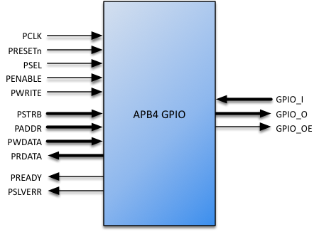
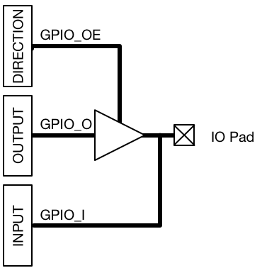
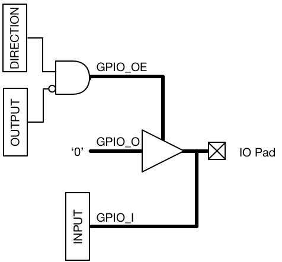

# Introduction

The APB4 GPIO Core is fully parameterised core designed to provide a user-defined number of general purpose, bidirectional IO to a design.

The IO are accessible via an *AMBA APB v2.0 Specification* interface – typically referred to as APB4 – and the core operates synchronously with the rising edge of the APB4 Bus Clock..

Inputs to the core may operate asynchronously to the core and will be automatically synchronised to the bus clock. Outputs may be configured to operate in push-pull mode or open-drain.

## Features

-   Compliant with AMBA APB v2.0 Specification

-   User-defined number of Bi-directional General Purpose IO

-   Automatic synchronisation of General Inputs to Bus Clock

-   Each General Output configurable as push-pull or open-drain

# Specifications

## Functional Description

The Roa Logic APB4 GPIO is a configurable, fully parameterized soft IP to enable general connectivity to a APB4 based Master (Host) It is fully compliant with the *AMBA APB v2.0* bus protocols.

The IP contains a single Master Interface to connect to the APB4 Host and a user defined number of General Purpose IO, configurable as a bi-directional bus as shown below:

The core operates synchronously with the APB4 Bus Clock. Inputs may be asynchronous to this bus clock and therefore the implements configurable length synchronisation

## Operating Modes

The core supports bidirectional IO pads as shown in Figure 3, where each IO may operate in a push-pull or open-drain mode. The mode of each IO is defined via the MODE register.

| **Note:** |                                                                                                                                    |
|:----------|:-----------------------------------------------------------------------------------------------------------------------------------|
|           | IO Pads are not implemented within the APB4 GPIO core – this technology specific capability is the responsibility of the designer. |

### Push-Pull Mode

In push-pull mode, the `GPIO_O` bus is driven from an internal `OUTPUT` register and `GPIO_OE` is controlled via the DIRECTION register

Logically the push-pull mode is configured as follows:

### Open-Drain Mode

In open-drain mode, GPIO\_O is always driven low (‘0’) and individual GPIO\_OE signals set to enable (i.e. Logic ‘0’) or high-Z (Logic ‘1’) at the output buffer corresponding to the value of the OUTPUT register.

### Pad Inference

The inclusion of technology specific IO Pads is not part of the APB4 GPIO core and instead left to the designer. Pads may be behaviourally inferred however as follows:

`PAD[n] <= GPIO_OE[n] ? GPIO_O[n] : 1’bz;`

# Configurations

## Introduction

The Roa Logic AHB-Lite APB4 GPIO is a fully configurable General Purpose Input/Output core. The core parameters and configuration options are described in this section.

## Core Parameters

| Parameter      |   Type  | Default | Description                                     |
|:---------------|:-------:|:-------:|:------------------------------------------------|
| `PDATA_SIZE`   | Integer |    8    | APB4 Data Bus & GPIO Size                       |
| `INPUT_STAGES` | Integer |    3    | Number of `GPIO_I` input synchronization stages |

### PDATA\_SIZE

The `PDATA_SIZE` parameter specifies the width of the APB4 data bus and corresponding GPIO interface width. This parameter must equal an integer multiple of bytes.

### INPUT\_STAGES

The APB4 GPIO inputs are sampled on the rising edge of the APB4 bus clock (`PCLK`). As these inputs may be asynchronous to the bus clock, the core automatically synchronises these signals and the `INPUT_STAGES` parameter determines the number of synchronisation stages.

Increasing this parameter reduces the possibility of metastability due to input signals changing state while being sampled, but at the cost of increased latency.

The minimum and default value of the `INPUT_STAGES` parameter is 3

### Registers

The APB4 GPIO core implements 4 user accessible registers. These are described below:

| **Register** |  **Address** | **Access** | **Function**                 |
|:-------------|:------------:|:----------:|:-----------------------------|
| `INPUT`      | `Base + 0x3` |  Read Only | Input Data Store             |
| `OUTPUT`     | `Base + 0x2` | Read/Write | Output Data Store            |
| `DIRECTION`  | `Base + 0x1` | Read/Write | Output Enable control        |
| `MODE`       | `Base + 0x0` | Read/Write | Push-Pull or Open-Drain Mode |

### INPUT

INPUT is a `PDATA_SIZE` bits wide read-only register accessible at the address 0x3.

On the rising edge of the APB4 Bus Clock (`PCLK`) input data on pins `GPIO_I` is sampled, synchronised and stored in the `INPUT` register where it may be read via the APB4 Bus Interface.

### OUTPUT

OUTPUT is a `PDATA_SIZE` bits wide read/write register accessible at the address `0x2`.

Data to be transmitted from the APB4 GPIO core via the `GPIO_O` & `GPIO_OE` buses is written from the APB4 Interface to the OUTPUT register.

### DIRECTION

DIRECTION is a `PDATA_SIZE` bits wide active-high read/write register, accessible at the address `0x1`, and controls the output enable bus `GPIO_OE`.

| **DIRECTION\[n\]** | **Direction** |
|:------------------:|:--------------|
|          0         | Input         |
|          1         | Output        |

### MODE

MODE is a PDATA\_SIZE bits wide Read/Write register accessible at the address 0x0. It individually sets the operating mode for each signal of the GPIO\_O and GPIO\_OE buses as either push-pull or open drain, as follows:

| **MODE\[n\]** | **Operating Mode** |
|:-------------:|:-------------------|
|       0       | Push-Pull          |
|       1       | Open Drain         |

In push-pull mode, data written to the OUTPUT register directly drives the output bus `GPIO_O`. The `DIRECTION` register is then used to enable `GPIO_O` to drive the IO pad when set to ‘Output’ mode (‘1’).

In open-drain mode, `GPIO_O` is permanently driven low (‘0’) and the OUTPUT register sets `GPIO_OE` to ‘Output’ to assert a logic ‘0’ on the bus, or ‘Input’ (i.e. High-Z) to assert a logic ‘1’.

# Interfaces

## APB4 (Peripheral) Interface

The APB4Interface is a regular APB4 Master Interface. All signals defined in the protocol are supported as described below. See the *AMBA APB Protocol v2.0 Specifications* for a complete description of the signals.

| **Port**  |    **Size**    | **Direction** | **Description**               |
|:----------|:--------------:|:-------------:|:------------------------------|
| `PRESETn` |        1       |     Input     | Asynchronous active low reset |
| `PCLK`    |        1       |     Input     | Clock Input                   |
| `PSEL`    |        1       |     Output    | Peripheral Select             |
| `PENABLE` |        1       |     Output    | Peripheral Enable Control     |
| `PPROT`   |        3       |     Output    | Transfer Protection Level     |
| `PWRITE`  |        1       |     Output    | Write Select                  |
| `PSTRB`   | `PDATA_SIZE/8` |     Output    | Byte Lane Indicator           |
| `PADDR`   |  `PADDR_SIZE`  |     Output    | Address Bus                   |
| `PWDATA`  |  `PDATA_SIZE`  |     Output    | Write Data Bus                |
| `PRDATA`  |  `PDATA_SIZE`  |     Input     | Read Data Bus                 |
| `PREADY`  |        1       |     Input     | Transfer Ready Input          |
| `PSLVERR` |        1       |     Input     | Transfer Error Indicator      |

### PRESETn

When the active low asynchronous `PRESETn` input is asserted (‘0’), the APB4 interface is put into its initial reset state.

### PCLK

`PCLK` is the APB4 interface system clock. All internal logic for the APB4 interface operates at the rising edge of this system clock and APB4 bus timings are related to the rising edge of `PCLK`.

### PSEL

The APB4 Bridge generates `PSEL`, signaling to an attached peripheral that it is selected and a data transfer is pending.

### PENABLE

The APB4 Bridge asserts `PENABLE` during the second and subsequent cycles of an APB4 data transfer.

### PPROT

`PPROT[2:0]` indicates the protection type of the data transfer, with 3 levels of protection supported as follows:

| **Bit\#** | **Value** | **Description**    |
|:---------:|:---------:|:-------------------|
|     2     |     1     | Instruction Access |
|           |     0     | Data Access        |
|     1     |     1     | Non-Secure Access  |
|           |     0     | Secure Access      |
|     0     |     1     | Privileged Access  |
|           |     0     | Normal Access      |

### PWRITE

`PWRITE` indicates a data write access when asserted high (‘1’) and a read data access when de-asserted (‘0’)

### PSTRB

There is one `PSTRB` signal per byte lane of the APB4 write data bus (`PWDATA`). These signals indicate which byte lane to update during a write transfer such that `PSTRB[n]` corresponds to `PWDATA[(8n+7):8n]`.

### PADDR

`PADDR` is the APB4 address bus. The bus width is defined by the `PADDR_SIZE` parameter and is driven by the APB4 Bridge core.

### PWDATA

`PWDATA` is the APB4 write data bus and is driven by the APB4 Bridge core during write cycles, indicated when `PWRITE` is asserted (‘1’). The bus width must be byte-aligned and is defined by the `PDATA_SIZE` parameter.

### PRDATA

`PRDATA` is the APB4 read data bus. An attached peripheral drives this bus during read cycles, indicated when `PWRITE` is de-asserted (‘0’). The bus width must be byte-aligned and is defined by the `PDATA_SIZE` parameter.

### PREADY

`PREADY` is driven by the attached peripheral. It is used to extend an APB4 transfer.

### PSLVERR

`PSLVERR` indicates a failed data transfer when asserted (‘1’). As APB4 peripherals are not required to support this signal it must be tied LOW (‘0’) when unused.

## GPIO Interface

| Port      |     Size     | Direction | Description          |
|:----------|:------------:|:---------:|:---------------------|
| `GPIO_I`  | `PDATA_SIZE` |   Input   | Input Signals        |
| `GPIO_O`  | `PDATA_SIZE` |   Output  | Output Signals       |
| `GPIO_OE` | `PDATA_SIZE` |   Output  | Output Enable Signal |

### GPIO\_I

`GPIO_I` is the input bus. The bus is `PDATA_SIZE` bits wide and each bit is sampled on the rising edge of the APB4 bus clock `PCLK`. As the inputs may be asynchronous to the bus clock, synchronisation is implemented within the core.

### GPIO\_O

`GPIO_O` is the output bus and is `PDATA_SIZE` bits wide. Data is driven onto the output bus on the rising edge of the APB4 bus clock `PCLK`.

### GPIO\_OE

`GPIO_OE` is an active-high Output Enable bus and is `PDATA_SIZE` bits wide.

The specific functionality of the `GPIO_OE` bus is defined by the `MODE` register. In push-pull mode it is used to enable a bidirectional output buffer whose input is driven the `GPIO_O` bus

In open-drain mode the `GPIO_OE` bus is used to enable a logic ‘0’ to be driven from the `GPIO_O` bus, and a logic ’1’ by disabling (‘High-Z’) the output buffer.

# Resources

Below are some example implementations for various platforms. All implementations are push button, no effort has been undertaken to reduce area or improve performance.

| Platform | DFF | Logic Cells | Memory | Performance (MHz) |
|:---------|:----|:------------|:-------|:------------------|
|          |     |             |        |                   |
|          |     |             |        |                   |
|          |     |             |        |                   |

# Revision History

| Date | Rev. | Comments |
|:-----|:-----|:---------|
|      | 1.0  |          |
|      |      |          |
|      |      |          |
|      |      |          |
